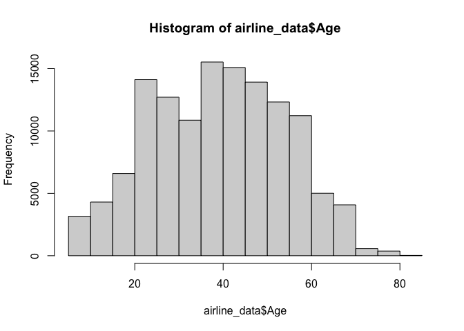
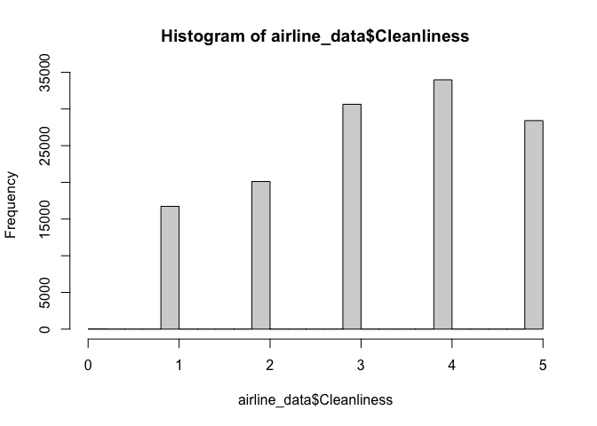
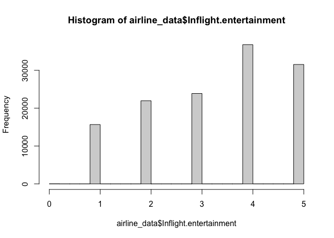
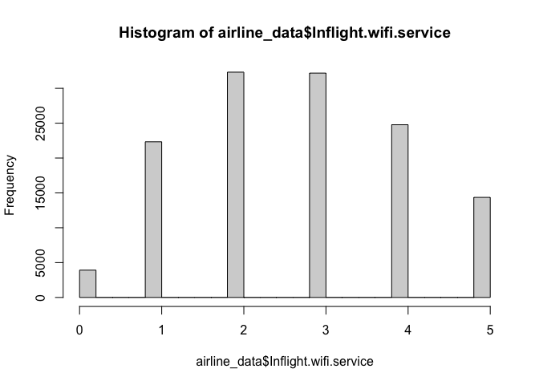
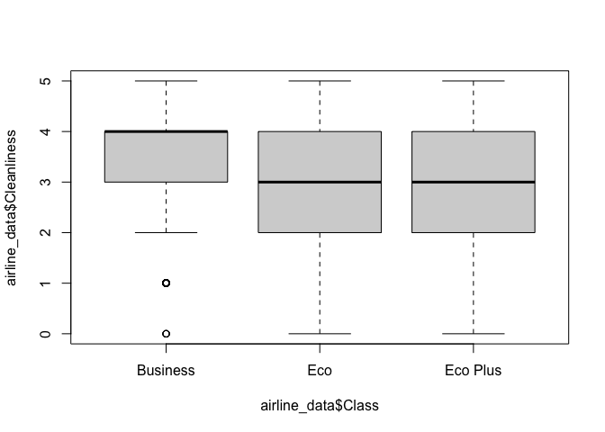
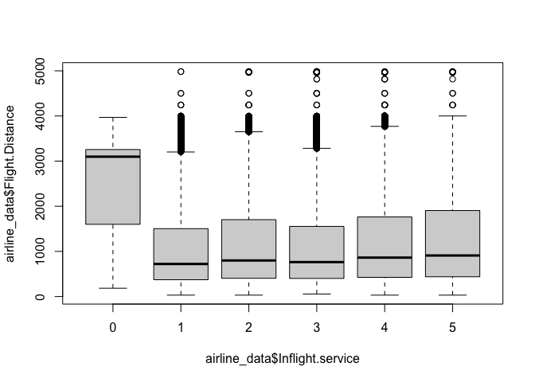
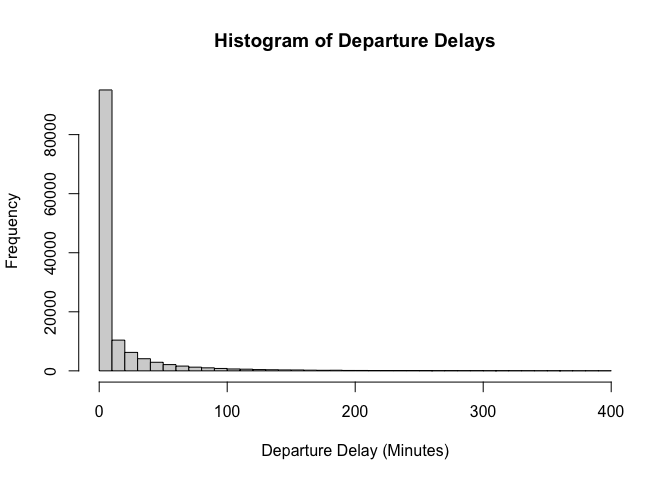

ML Project: Airline Passenger Satisfaction
================
Liv Marcinkus, Giulia Neves Monteiro, and Ruthie Montella
2024-11-12

Read in our dataset:

``` r
test_data <- read.csv('~/Desktop/Machine Learning/test.csv')
train_data <- read.csv('~/Desktop/Machine Learning/train.csv')
#irline_data_start <- cbind(test_data, train_data)
airline_data_merge <- merge(test_data, train_data, by = c("X","Gender","id", "Customer.Type","Age","Type.of.Travel","Class", "Flight.Distance","Inflight.wifi.service","Departure.Arrival.time.convenient","Ease.of.Online.booking", "Gate.location","Food.and.drink","Online.boarding","Seat.comfort","Inflight.entertainment", "On.board.service","Leg.room.service","Baggage.handling", "Checkin.service", "Inflight.service", "Cleanliness","Departure.Delay.in.Minutes", "Arrival.Delay.in.Minutes","satisfaction" ),all = TRUE)     
duplicates <- airline_data_merge[duplicated(airline_data_merge$id),]
airline_data <- airline_data_merge[!duplicated(airline_data_merge$id),]

colnames(airline_data)
```

     [1] "X"                                 "Gender"                           
     [3] "id"                                "Customer.Type"                    
     [5] "Age"                               "Type.of.Travel"                   
     [7] "Class"                             "Flight.Distance"                  
     [9] "Inflight.wifi.service"             "Departure.Arrival.time.convenient"
    [11] "Ease.of.Online.booking"            "Gate.location"                    
    [13] "Food.and.drink"                    "Online.boarding"                  
    [15] "Seat.comfort"                      "Inflight.entertainment"           
    [17] "On.board.service"                  "Leg.room.service"                 
    [19] "Baggage.handling"                  "Checkin.service"                  
    [21] "Inflight.service"                  "Cleanliness"                      
    [23] "Departure.Delay.in.Minutes"        "Arrival.Delay.in.Minutes"         
    [25] "satisfaction"                     

``` r
nrow(airline_data)
```

    [1] 129880

We merged our train and test data sets in order to complete ealy
analysis with full data set. This led to duplicate rows under the “X”
column, however the “id” column still represents our unique identifiers
of each respondent.

## Inital Exploration & Summary Stats

First looking at the dataset as a whole:

``` r
str(airline_data)
```

    'data.frame':   129880 obs. of  25 variables:
     $ X                                : int  0 0 1 1 2 2 3 3 4 4 ...
     $ Gender                           : chr  "Female" "Male" "Female" "Male" ...
     $ id                               : int  19556 70172 90035 5047 110028 12360 24026 77959 36875 119299 ...
     $ Customer.Type                    : chr  "Loyal Customer" "Loyal Customer" "Loyal Customer" "disloyal Customer" ...
     $ Age                              : int  52 13 36 25 26 20 25 44 49 61 ...
     $ Type.of.Travel                   : chr  "Business travel" "Personal Travel" "Business travel" "Business travel" ...
     $ Class                            : chr  "Eco" "Eco Plus" "Business" "Business" ...
     $ Flight.Distance                  : int  160 460 2863 235 1142 192 562 3377 1182 214 ...
     $ Inflight.wifi.service            : int  5 3 1 3 2 2 2 0 2 3 ...
     $ Departure.Arrival.time.convenient: int  4 4 1 2 2 0 5 0 3 3 ...
     $ Ease.of.Online.booking           : int  3 3 3 3 2 2 5 0 4 3 ...
     $ Gate.location                    : int  4 1 1 3 2 4 5 2 3 3 ...
     $ Food.and.drink                   : int  3 5 5 1 5 2 2 3 4 4 ...
     $ Online.boarding                  : int  4 3 4 3 5 2 2 4 1 5 ...
     $ Seat.comfort                     : int  3 5 5 1 5 2 2 4 2 5 ...
     $ Inflight.entertainment           : int  5 5 4 1 5 2 2 1 2 3 ...
     $ On.board.service                 : int  5 4 4 1 4 4 2 1 2 3 ...
     $ Leg.room.service                 : int  5 3 4 5 3 1 5 1 2 4 ...
     $ Baggage.handling                 : int  5 4 4 3 4 3 3 1 2 4 ...
     $ Checkin.service                  : int  2 4 3 1 4 2 1 3 4 3 ...
     $ Inflight.service                 : int  5 5 4 4 4 2 4 1 2 3 ...
     $ Cleanliness                      : int  5 5 5 1 5 2 2 4 4 3 ...
     $ Departure.Delay.in.Minutes       : int  50 25 0 1 0 0 11 0 0 0 ...
     $ Arrival.Delay.in.Minutes         : num  44 18 0 6 0 0 9 6 20 0 ...
     $ satisfaction                     : chr  "satisfied" "neutral or dissatisfied" "satisfied" "neutral or dissatisfied" ...

``` r
head(airline_data)
```

      X Gender     id     Customer.Type Age  Type.of.Travel    Class
    1 0 Female  19556    Loyal Customer  52 Business travel      Eco
    2 0   Male  70172    Loyal Customer  13 Personal Travel Eco Plus
    3 1 Female  90035    Loyal Customer  36 Business travel Business
    4 1   Male   5047 disloyal Customer  25 Business travel Business
    5 2 Female 110028    Loyal Customer  26 Business travel Business
    6 2   Male  12360 disloyal Customer  20 Business travel      Eco
      Flight.Distance Inflight.wifi.service Departure.Arrival.time.convenient
    1             160                     5                                 4
    2             460                     3                                 4
    3            2863                     1                                 1
    4             235                     3                                 2
    5            1142                     2                                 2
    6             192                     2                                 0
      Ease.of.Online.booking Gate.location Food.and.drink Online.boarding
    1                      3             4              3               4
    2                      3             1              5               3
    3                      3             1              5               4
    4                      3             3              1               3
    5                      2             2              5               5
    6                      2             4              2               2
      Seat.comfort Inflight.entertainment On.board.service Leg.room.service
    1            3                      5                5                5
    2            5                      5                4                3
    3            5                      4                4                4
    4            1                      1                1                5
    5            5                      5                4                3
    6            2                      2                4                1
      Baggage.handling Checkin.service Inflight.service Cleanliness
    1                5               2                5           5
    2                4               4                5           5
    3                4               3                4           5
    4                3               1                4           1
    5                4               4                4           5
    6                3               2                2           2
      Departure.Delay.in.Minutes Arrival.Delay.in.Minutes            satisfaction
    1                         50                       44               satisfied
    2                         25                       18 neutral or dissatisfied
    3                          0                        0               satisfied
    4                          1                        6 neutral or dissatisfied
    5                          0                        0               satisfied
    6                          0                        0 neutral or dissatisfied

``` r
tail(airline_data)
```

                X Gender    id     Customer.Type Age  Type.of.Travel    Class
    129875 103898   Male 60666    Loyal Customer  50 Personal Travel      Eco
    129876 103899 Female 94171 disloyal Customer  23 Business travel      Eco
    129877 103900   Male 73097    Loyal Customer  49 Business travel Business
    129878 103901   Male 68825 disloyal Customer  30 Business travel Business
    129879 103902 Female 54173 disloyal Customer  22 Business travel      Eco
    129880 103903   Male 62567    Loyal Customer  27 Business travel Business
           Flight.Distance Inflight.wifi.service Departure.Arrival.time.convenient
    129875            1620                     3                                 1
    129876             192                     2                                 1
    129877            2347                     4                                 4
    129878            1995                     1                                 1
    129879            1000                     1                                 1
    129880            1723                     1                                 3
           Ease.of.Online.booking Gate.location Food.and.drink Online.boarding
    129875                      3             4              2               3
    129876                      2             3              2               2
    129877                      4             4              2               4
    129878                      1             3              4               1
    129879                      1             5              1               1
    129880                      3             3              1               1
           Seat.comfort Inflight.entertainment On.board.service Leg.room.service
    129875            2                      2                4                3
    129876            2                      2                3                1
    129877            5                      5                5                5
    129878            5                      4                3                2
    129879            1                      1                4                5
    129880            1                      1                1                1
           Baggage.handling Checkin.service Inflight.service Cleanliness
    129875                4               2                4           2
    129876                4               2                3           2
    129877                5               5                5           4
    129878                4               5                5           4
    129879                1               5                4           1
    129880                4               4                3           1
           Departure.Delay.in.Minutes Arrival.Delay.in.Minutes
    129875                          0                        0
    129876                          3                        0
    129877                          0                        0
    129878                          7                       14
    129879                          0                        0
    129880                          0                        0
                      satisfaction
    129875 neutral or dissatisfied
    129876 neutral or dissatisfied
    129877               satisfied
    129878 neutral or dissatisfied
    129879 neutral or dissatisfied
    129880 neutral or dissatisfied

``` r
dim(airline_data)
```

    [1] 129880     25

To check the quality of the dataset we checked how many NA values are
present:

``` r
colSums(is.na(airline_data)) # 83 NA's in entire dataset 
```

                                    X                            Gender 
                                    0                                 0 
                                   id                     Customer.Type 
                                    0                                 0 
                                  Age                    Type.of.Travel 
                                    0                                 0 
                                Class                   Flight.Distance 
                                    0                                 0 
                Inflight.wifi.service Departure.Arrival.time.convenient 
                                    0                                 0 
               Ease.of.Online.booking                     Gate.location 
                                    0                                 0 
                       Food.and.drink                   Online.boarding 
                                    0                                 0 
                         Seat.comfort            Inflight.entertainment 
                                    0                                 0 
                     On.board.service                  Leg.room.service 
                                    0                                 0 
                     Baggage.handling                   Checkin.service 
                                    0                                 0 
                     Inflight.service                       Cleanliness 
                                    0                                 0 
           Departure.Delay.in.Minutes          Arrival.Delay.in.Minutes 
                                    0                               393 
                         satisfaction 
                                    0 

To replace our NA values with 0’s (since all are located in the
Arrival.Delay.in.Minutes column):

``` r
airline_data[is.na(airline_data)] <- 0
```

### Examination of individual variables:

- Looking at variables we hypothesize will be strongly related to
  customer satisfaction:

#### Age

``` r
summary(airline_data$Age)
```

       Min. 1st Qu.  Median    Mean 3rd Qu.    Max. 
       7.00   27.00   40.00   39.43   51.00   85.00 

``` r
hist(airline_data$Age)
```

<!-- --> The plot
reveals that there are no significantly over represented groups within
the `Age` variable, with the highest number of responses coming from
people within the range of roughly 35-55 years old.

#### Gender

``` r
table(airline_data$Gender)
```


    Female   Male 
     65899  63981 

#### Customer Type - loyal or disloyal

``` r
table(airline_data$Customer.Type)
```


    disloyal Customer    Loyal Customer 
                23780            106100 

``` r
# many more loyal customers than non loyal 
```

#### Type of Travel and Class Traveled

``` r
table(airline_data$Type.of.Travel) # way more travel for business than personal reasons 
```


    Business travel Personal Travel 
              89693           40187 

``` r
table(airline_data$Class) 
```


    Business      Eco Eco Plus 
       62160    58309     9411 

#### Cleanliness

``` r
table(airline_data$Cleanliness)
```


        0     1     2     3     4     5 
       14 16729 20113 30639 33969 28416 

``` r
hist(airline_data$Cleanliness)
```

<!-- -->

While not used in the most conventional way, this visual allows us to
visually examine the distribution of responant ratings within the
`Cleanliness` variable. It enables us to easily identify that most
people rated airplane cleanliness in the 3-5 range.

#### Flight Distance

``` r
summary(airline_data$Flight.Distance)
```

       Min. 1st Qu.  Median    Mean 3rd Qu.    Max. 
         31     414     844    1190    1744    4983 

#### Inflight Entertainment and Wifi Service Rating Distributions

``` r
hist(airline_data$Inflight.entertainment)
```

<!-- -->

The `Inflight.entertainment` histogram reveals that in general most
people are fairly satisfied with their in flight entertainment options,
with 4 as the mode of the ratings.

``` r
hist(airline_data$Inflight.wifi.service)
```

<!-- -->

The `Inflight.wifi.service` visual reveals that in flight WiFi may be an
area for improvement for airlines as most respondents rated the service
around 2 or 3 out of a possible 5.

#### CheckIn Service

``` r
# summary(airline_data$Checkin.service)
table(airline_data$Checkin.service)
```


        0     1     2     3     4     5 
        1 16108 16102 35453 36333 25883 

#### Arrival Delay

``` r
summary(airline_data$Arrival.Delay.in.Minutes)
```

       Min. 1st Qu.  Median    Mean 3rd Qu.    Max. 
       0.00    0.00    0.00   15.05   13.00 1584.00 

The median arrival delay being 0 indicates that the vast majority of
flights had no delay at all.

#### Departure Delay

``` r
summary(airline_data$Departure.Delay.in.Minutes)
```

       Min. 1st Qu.  Median    Mean 3rd Qu.    Max. 
       0.00    0.00    0.00   14.71   12.00 1592.00 

The median departure delay being 0 indicates that the vast majority of
flights had no delay at all.

## Data Visualizations

#### Relationship between Cleanliness and Class flown:

``` r
boxplot(airline_data$Cleanliness ~ airline_data$Class)
```

<!-- -->

This boxplot reveals that the distribution of customers’ `Cleanliness`
rating somewhat differs when examined by `Class` flown. It is clear that
the median cleanliness rating for business class flyers is higher than
ratings of those who flew in economy plus or economy. Interestingly,
there is not a similar difference reflected in the cleanliness ratings
between the economy and economy plus categories. This indicates that the
divide to focus on is that between the business class and the rest of
the classes.

#### Flight Distance by Inflight Service Ratings

``` r
boxplot(airline_data$Flight.Distance ~ airline_data$Inflight.service)
```

<!-- -->

We also wanted to take a look at how `Inflight.service` ratings are
distributed by `Flight.Distance`. Notably, all of the ratings of 0 for
in flight service correlated with longer median flight distances. This
is really surprising as one would reasonably assume that longer flights
would be accompanied by better in flight service, so this observation is
definitely something we will further examine later in our analysis. With
the exception of the 0 category, however, the remaining in flight
service ratings are all relatively evenly distributed between 1 and 5,
with the flight distances for each rating also being generally very
similar.

#### Distribution of Departure Delays (in minutes)

``` r
# hist(airline_data$Departure.Delay.in.Minutes)
subset_most_vals <- airline_data$Departure.Delay.in.Minutes[airline_data$Departure.Delay.in.Minutes < 400]
breaks <- seq(0, 400, by = 10)  # Create bins every 10 minutes
hist(subset_most_vals, 
     breaks = breaks,  # Use the custom breaks
     main = "Histogram of Departure Delays", 
     xlab = "Departure Delay (Minutes)", 
     ylab = "Frequency")
```

<!-- -->

In order to gain insights from this histogram of
`Departure.Delay.in.Minutes` I had to perform a little bit of data
manipulation. I first tried to remove only a couple of outliers but
still did not have a good view of the distribution, as the x axis
extended all the way to 1200 minutes, making the data not readable. My
next step was to filter the data so only departure delays less than 500
minutes were visible. When this still did not produce a readable visual
I filtered the results all the way down departure delays under 400
minutes. While some values were excluded from this visual, the majority
of the values are still included and it allows us to visualize the
general distribution of departure delays. This being said it is clear
that the vast majority of flights experience no delay, and the number of
flights decreases significantly as the departure delays become longer
and longer.
